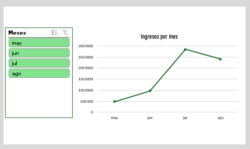
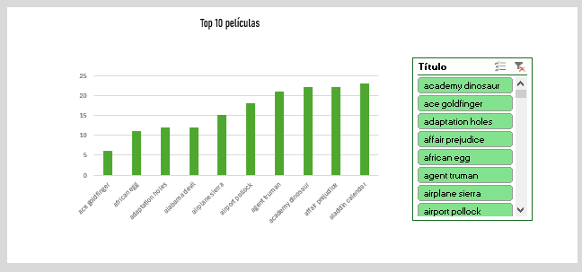
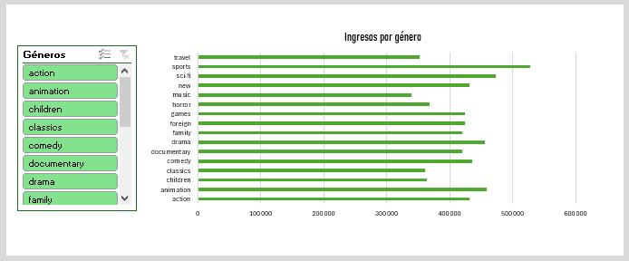
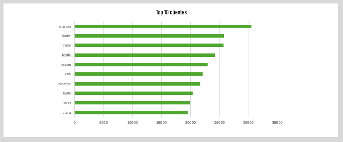
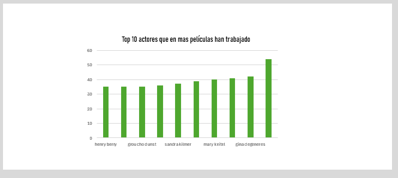
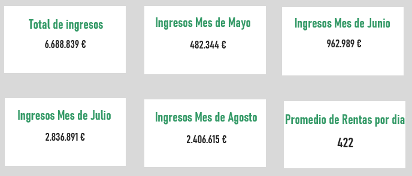

# 🎬 Análisis de Dashboard

## 📝 Descripción del Proyecto
Este repositorio contiene un tablero de control (dashboard) desarrollado en Excel mediante **Tablas Dinámicas**. El análisis se centra en el rendimiento de ingresos, preferencias de categorías y métricas operativas durante el periodo mayo-agosto de 2005.

## 📊 Estructura del Dashboard

El análisis se divide en 6 áreas clave:

### 1. Tendencias Temporales
*   **Línea de Tiempo de Ingresos:** Evolución mensual de la `Suma de amount`. Se identifica un crecimiento masivo de mayo a julio.

*   **Promedio por día:** Análisis del ticket promedio diario, manteniéndose estable cerca de los **$421.72**.

### 2. Análisis de Contenido
*   **Top 10 Películas:** Ranking por volumen de renta. Películas como *Apache Divine* y *Bucket Brotherhood* lideran el catálogo.

*   **Ingresos por Género:** Distribución de ingresos por género (Action, Animation, Children, etc.). 
    *   *Sugerencia visual:* Usar gráfico circular o de dona.


### 3. Operaciones y Talento
*   **Clientes vs Rentas:** Relación entre el volumen de clientes y los ingresos generados.

*   **Recuento por Títulos:** Inventario de frecuencia de rentas por película.
*   **Recuento por Actores:** Identificación de los actores con mayor presencia en las películas rentadas (ej. Angela Witherspoon, Julia DeGeneres).


## 📉 Métricas Principales (KPIs)

| Métrica | Valor Total |
| :--- | :--- |
| **Ingresos Totales (Suma de amount)** | $6,688,839 |
| **Promedio General de Renta** | $421.72 |
| **Total de Registros de Películas** | 318 |
| **Total de Actores Analizados** | 394 |


## 🛠️ Visualizaciones Recomendadas
Para mejorar la interpretación de estas tablas en un entorno BI, se recomienda:
1. **Gráfico de Barras Horizontales:** Para el Top 10 de películas y actores.
2. **Gráfico de Líneas:** Para la evolución temporal de ingresos (May-Ago).
3. **Treemap:** Para visualizar la jerarquía de ingresos por categoría.

---
## ⚙️ Instrucciones de Actualización
Para actualizar los datos: 
1. Primero se ejecuta 
    ```bash 
    python src/sakila_ETL.py
    ```
2. Abrir el archivo: 
    **dashboard\Sakila_Dashboard.xlsx**
3. Refrescar los datos:
     desde Excel presionando ```F5``` o utilizando la opción **Actualizar Todo** en la pestaña **Datos**.
